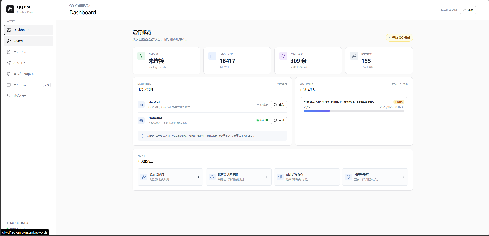

# QQkeywordForward

QQ 群关键词监听、提醒转发与群发机器人的一体化控制台。



基于 NapCat + OneBot V11 + NoneBot 接收群消息，关键词命中后经 QQ 私聊或 SMTP 邮件转发提醒；自带 FastAPI + React 控制台，用于配置关键词、选择群聊、下发群发任务并查看运行状态。

## 功能特性

- **关键词规则**：按群配置监听关键词，支持换行、中文/英文逗号或空格一次批量录入，命中后保留群、发送者与原始文本
- **提醒转发**：命中后推送 QQ 私聊或 SMTP 邮件，多个收件人各收一份，发送失败自动重试
- **跨群重复过滤**：同一消息正文只提醒一次，可配置冷却时间与广告词过滤
- **群发任务**：多选群聊逐条发送，支持群间延时、保护限速与自动循环
- **富文本**：正文支持换行，可附带 JPG / PNG / GIF / WEBP 图片
- **群列表自动同步**：NoneBot 连接后自动拉取群号、群名与头像，换号自动失效旧号的群
- **NapCat 运维**：二维码登录、登录状态、重启与日志查看都在控制台内完成
- **安全**：管理员会话认证、Bearer API 兼容与 SQLite 审计日志
- **持久化**：SQLite WAL，全部数据落在宿主机 `data/` 目录

## 运行要求

- Docker Engine 24+ 与 Docker Compose v2+
- 能访问 Docker Hub（国内建议先配置镜像加速）
- 一个用于登录 NapCat 的 QQ 账号
- SMTP 账号（仅在使用邮件通知时需要）

## 快速开始

### 1. 获取代码

```bash
git clone https://github.com/XtSilan/QQkeywordForward.git
cd QQkeywordForward
mkdir -p data/napcat data/nonebot data/logs/nonebot
```

`data/` 存放 NapCat 登录态、SQLite、上传图片与日志，该目录已被 Git 忽略。

### 2. 准备 `.env.prod`

在仓库根目录创建 `.env.prod`：

```dotenv
APP_ENV=prod
ENVIRONMENT=prod

# 必须替换为高强度随机字符串
ADMIN_TOKEN=请替换为高强度随机字符串
AUTH_SESSION_SECRET=请替换为另一组高强度随机字符串
AUTH_SESSION_TTL=86400

# NapCat WebUI，token 见 data/napcat/webui.json
NAPCAT_WEBUI_URL=http://napcat:6099
NAPCAT_WEBUI_TOKEN=NapCat-WebUI-token

# OneBot V11 鉴权（两组必须填相同值，都留空则不鉴权）
ONEBOT_ACCESS_TOKEN=
ONEBOT_V11_ACCESS_TOKEN=
ONEBOT_WS_URL=ws://nonebot:8081/onebot/v11/ws

# SMTP（不需要邮件通知时可留空）
SMTP_HOST=smtp.example.com
SMTP_PORT=587
SMTP_USERNAME=bot@example.com
SMTP_PASSWORD=邮箱密码
SMTP_FROM=bot@example.com
SMTP_STARTTLS=true
SMTP_SSL=false
SMTP_TIMEOUT=15

# 必须是 NapCat 容器能够访问到的地址
PUBLIC_BASE_URL=http://你的服务器IP:8080
MAX_UPLOAD_SIZE_MB=10
```

```bash
chmod 600 .env.prod
```

> [!WARNING]
> `.env.prod`、NapCat token、QQ 密码、SMTP 密码与 `data/` 都不要提交到版本库。正式使用前请至少替换 `ADMIN_TOKEN`、`AUTH_SESSION_SECRET` 和 NapCat token。

> [!IMPORTANT]
> `ONEBOT_ACCESS_TOKEN` 与 `ONEBOT_V11_ACCESS_TOKEN` 必须填**相同**的值：前者由 WebUI 下发给 NapCat（作为 `Authorization: Bearer` 头发起连接），后者由 NoneBot 的 OneBot V11 适配器校验入站连接。两者都留空则不校验；只填其中一个会导致连接失败（适配器有值而 NapCat 没带 token，会返回 403）。

### 3. 启动

```bash
docker compose config
docker compose up -d --build
docker compose ps
```

控制台地址：<http://localhost:8080>

| 服务 | 宿主机端口 | 用途 |
| --- | ---: | --- |
| WebUI | 8080 | 管理控制台 |
| NoneBot | 8081 | OneBot V11 反向连接入口 |
| NapCat | 6099 | NapCat WebUI |
| NapCat | 3001 | OneBot 网络端口 |

查看日志：

```bash
docker compose logs -f --tail=200 webui
docker compose logs -f --tail=200 nonebot
docker compose logs -f --tail=200 napcat
```

## 首次配置

### NapCat 登录

1. 打开控制台的「登录与 NapCat」。
2. 生成二维码，用 QQ 扫码登录。
3. 等待状态显示已登录。
4. 二维码过期时点击刷新；必要时执行重启。

也可以直接访问 <http://localhost:6099> 检查 NapCat 状态。

### OneBot 反向 WebSocket

反向 WS 由环境变量驱动，不需要在 NapCat WebUI 里手工配置。WebUI 容器启动后会运行一个后台同步任务：等 NapCat 登录完成后，每 30 秒检查一次 OneBot 配置，把名为 `websocket-client` 的条目对齐到：

```text
url   = ONEBOT_WS_URL      （默认 ws://nonebot:8081/onebot/v11/ws）
token = ONEBOT_ACCESS_TOKEN
```

只在 `url` / `enable` / `token` 与上述值不一致时才写回，其余字段（如 `reconnectInterval`）保持不动。因此改完这两项不需要手动改 NapCat，重启 webui 容器即可生效。

### 群列表同步

> [!NOTE]
> 群列表无需手工维护。OneBot 连接成功后，NoneBot 会立即同步一次并在之后每 5 分钟调用 `get_group_list`，自动写入群号、群名和头像地址；关键词与群发页面直接读取这份 SQLite 群列表。

## WebUI 使用

### 关键词与通知

「关键词」页面支持按换行、中文/英文逗号或空格一次输入多个关键词，再批量选择群聊和 QQ / 邮箱提醒地址。群聊列表支持全选与取消全选，匹配使用安全的字面量正则。

「系统设置」提供跨群重复消息过滤。默认同一完整消息正文首次命中正常提醒，第 2 次开始过滤 10 分钟；触发重复过滤的 QQ 账号也会同时冷却 10 分钟，期间该账号发送的其他关键词消息同样被过滤。空格、换行、大小写和全角/半角差异不影响重复识别，其他账号与正文不同的消息互不影响。被过滤的消息不会写入关键词历史。一条消息命中多个关键词时会合并为一条历史和一条提醒，提醒只包含关键词与消息内容；每个已配置收件人各收到一份，发送失败会进入后台重试。

### 群发与图片

1. 在「群发任务」中多选已同步群聊，也可以一键全选。
2. 输入正文，回车会作为换行发送。
3. 上传可选图片并预览。
4. 设置群间延时，最小 5 秒；后台仍执行每分钟最多 5 个群的保护限速。
5. 创建任务后查看排队、成功与失败数量。

> [!TIP]
> 图片保存在 `data/nonebot/uploads`。不要把 `PUBLIC_BASE_URL` 填成只有浏览器能访问的 `localhost`，否则 NapCat 容器无法下载图片。

## 认证与审计

生产环境访问控制台时使用管理员 token 登录，脚本仍可使用：

```http
Authorization: Bearer <ADMIN_TOKEN>
```

所有 `/api/` 的 POST、PUT、PATCH、DELETE 会写入 SQLite `audit_logs`，查询：

```bash
curl -H "Authorization: Bearer $ADMIN_TOKEN" \
  http://localhost:8080/api/audit-logs
```

审计不会保存 token、NapCat credential、SMTP 密码或消息正文。

## 持久化、重建与备份

重要数据位置：

```text
data/napcat/       NapCat 配置、登录态和设备信息
data/nonebot/      SQLite、上传图片和 NoneBot 数据
data/logs/nonebot/ NoneBot 日志
.env.prod          密钥和运行配置
```

普通重建不会丢失这些数据：

```bash
docker compose up -d --build --force-recreate
```

> [!CAUTION]
> 不要在日常操作中执行 `docker compose down -v`，也不要删除宿主机 `data/` 目录，否则会连同数据卷一起清空。不要把宿主机的虚拟环境直接挂载进容器；新增插件依赖时更新 `requirements.txt` 后重新构建镜像。

备份：

```bash
docker compose stop
tar --xattrs --acls -czf qq-bot-backup-$(date +%F).tar.gz \
  compose.yaml Dockerfile requirements.txt .env.prod app web data
docker compose start
```

恢复后执行：

```bash
docker compose config
docker compose up -d --build
```

NapCat 登录态恢复后仍可能因设备验证或风控要求重新登录。

## 更新与故障排查

```bash
git pull
docker compose build --pull
docker compose up -d --force-recreate
```

| 现象 | 排查方向 |
| --- | --- |
| 控制台未授权 | 检查 `APP_ENV=prod`、`ADMIN_TOKEN`，重新登录并确认浏览器允许 Cookie |
| NapCat 返回 Not Login | 先完成 QQ 登录，再重试状态或 OneBot 配置 |
| 群列表为空 | 检查 OneBot URL、NapCat 登录状态和 `nonebot` 日志 |
| 邮件发送失败 | 检查 SMTP 主机、端口、STARTTLS/SSL 与发件地址权限 |
| 图片发送失败 | 确认 `PUBLIC_BASE_URL` 能从 NapCat 容器访问，并检查上传目录权限 |
| 数据消失 | 确认没有删除 `data/`，且所有服务都使用当前 Compose 文件 |

健康检查：

```bash
curl http://localhost:8080/api/health
```

## 安全建议

- 正式环境务必替换 `ADMIN_TOKEN`、`AUTH_SESSION_SECRET` 和 NapCat token。
- 不要把 6099、3001、8081 暴露到公网，优先用防火墙限制来源。
- Docker socket 挂载会让控制台获得容器控制能力；不需要服务重启时应移除该挂载并关闭控制能力。
- 定期加密备份 `data/napcat`、`data/nonebot` 与 `.env.prod`。
- 生产环境固定镜像版本，不要使用 `latest`。

## 相关文档

- [NoneBot + NapCat Compose 方案](nonebot-napcat-docker-compose.md)
- [QQ 机器人设计](qq-bot-design.md)
- [WebUI 与 NapCat 运维设计](webui-ui-operations-design.md)
- [NoneBot 官方文档](https://nonebot.dev/docs/)
- [NapCat 官方文档](https://napneko.github.io/)